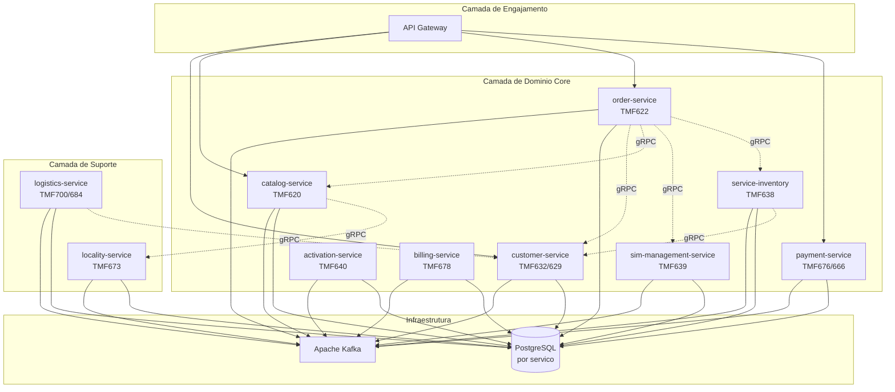
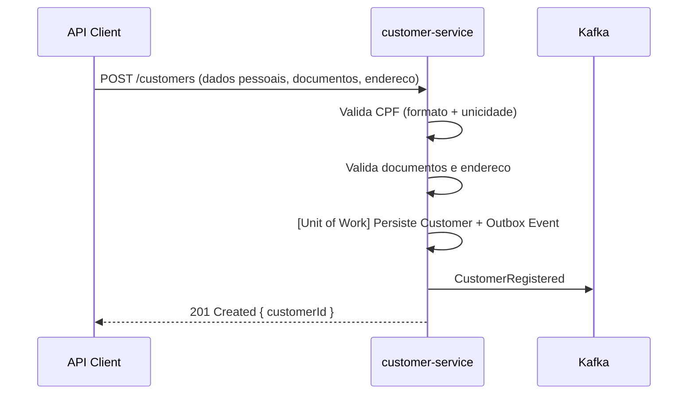
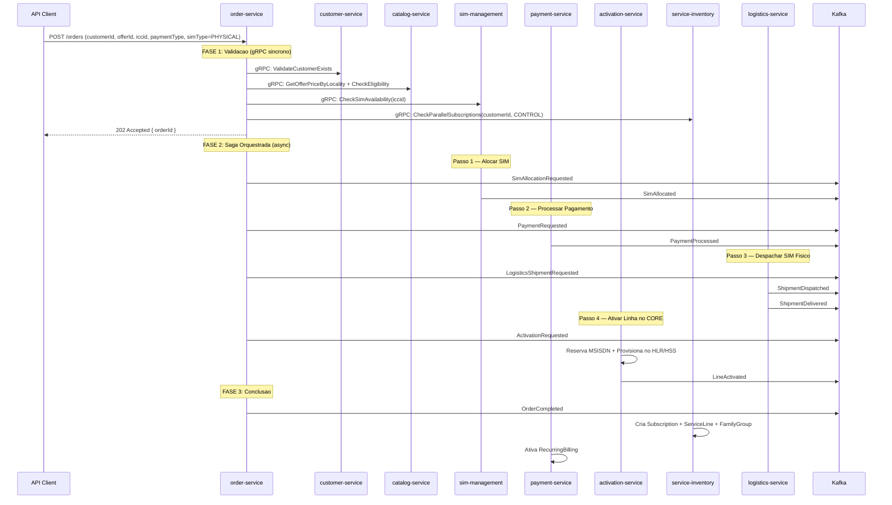
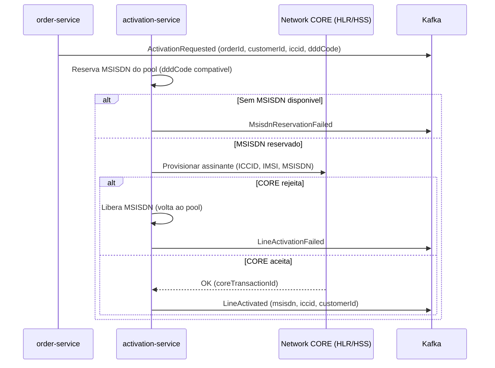
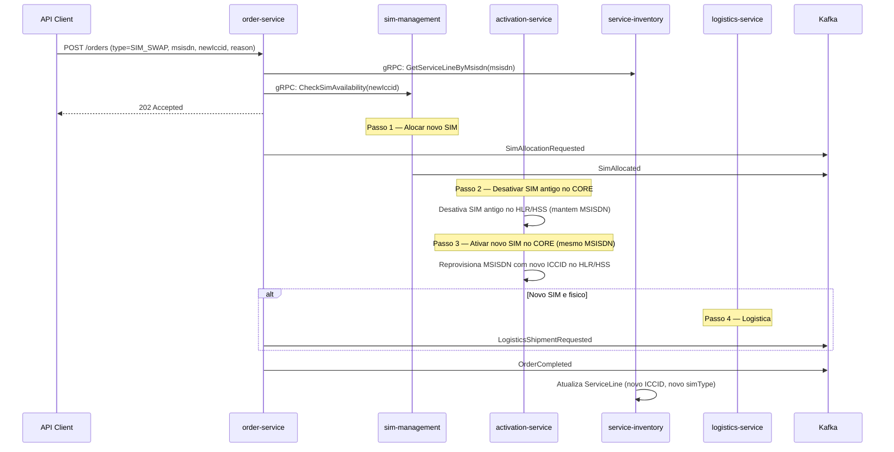
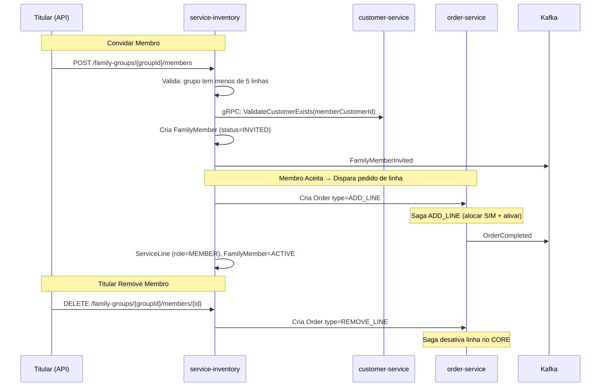
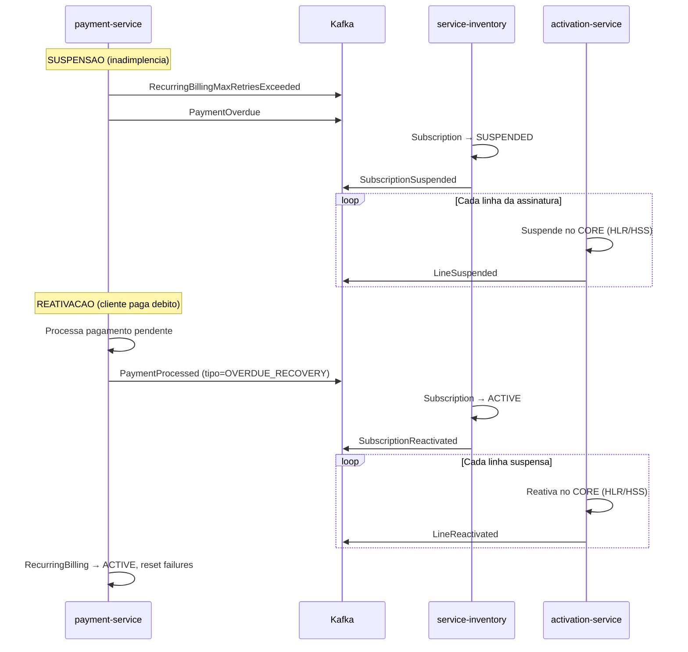
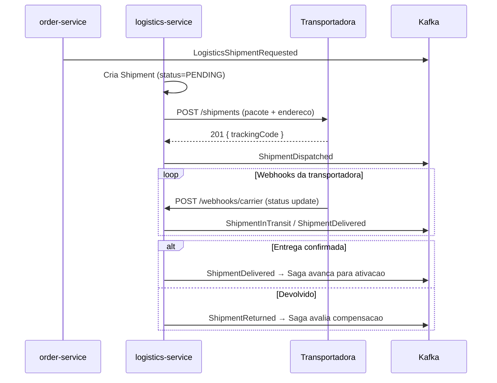
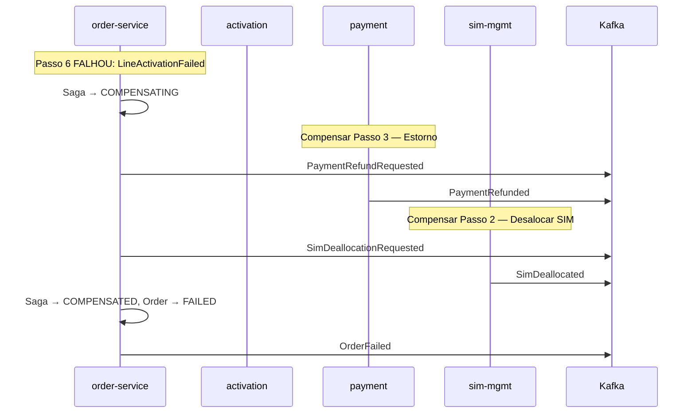
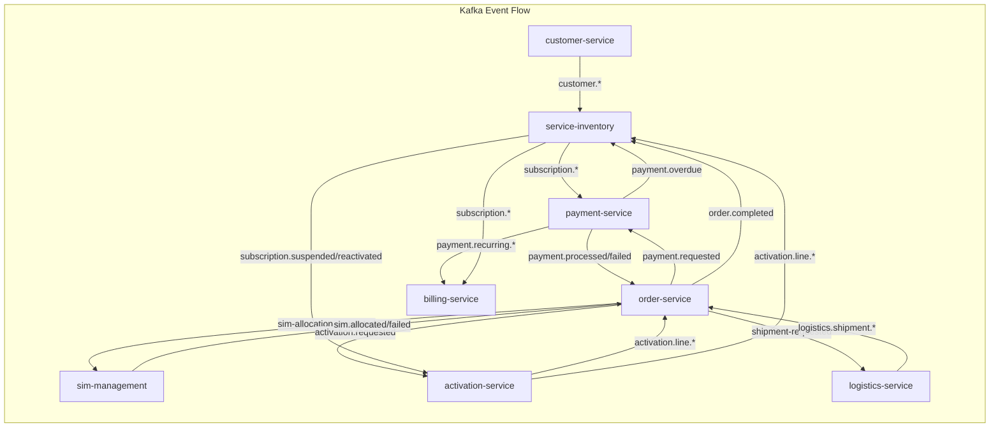

# PRD — Sistema de Telefonia Movel baseado em TM Forum ODA

## Documento de Requisitos do Produto

**Versao:** 1.0.0
**Data:** 2026-02-16
**Classificacao:** Confidencial

---

## Sumario

1. Contexto e Visao
2. Glossario
3. Mapeamento de Componentes ODA
4. Contextos Delimitados / Microsservicos
5. Catalogo de Eventos de Dominio
6. Fluxos de Negocio Chave
7. Fluxos de Saga com Compensacao
8. Mapa de Comunicacao entre APIs
9. Especificacao do Toolkit Compartilhado
10. Modelos de Dados
11. Requisitos Nao-Funcionais
12. Consideracoes Futuras

---

## 1. Contexto e Visao

### 1.1 Contexto do Negocio

O mercado brasileiro de telecomunicacoes opera sob regulamentacao da ANATEL e exige conformidade com normas especificas para gestao de linhas moveis, SIM cards, portabilidade numerica e cobranca recorrente. Este sistema tem como objetivo fornecer uma plataforma de backend robusta para uma operadora (ou MVNO) que comercializa planos de telefonia movel nas modalidades Controle, Pre-pago e Pos-pago.

### 1.2 Visao do Produto

Construir uma plataforma de microsservicos aderente ao framework TM Forum Open Digital Architecture (ODA), utilizando os padroes TMF como guia de modelagem de dominio, capaz de:

- Gerenciar o ciclo de vida completo do cliente, desde o cadastro ate a suspensao ou cancelamento.
- Suportar multiplos tipos de plano com regras de negocio distintas por modalidade.
- Orquestrar ativacao de linhas junto ao CORE de rede da operadora.
- Gerenciar inventario de SIM cards (fisicos e eSIM) provenientes de multiplos fornecedores.
- Processar pagamentos recorrentes com suporte a cartao de credito e PIX.
- Automatizar suspensao por inadimplencia e reativacao por pagamento.
- Prover logistica de entrega de SIM cards fisicos via transportadora.
- Estar arquiteturalmente preparado para portabilidade numerica futura.

### 1.3 Principios Arquiteturais

| Principio | Descricao |
|---|---|
| **Domain-Driven Design (DDD)** | Cada microsservico representa um Bounded Context com linguagem ubiqua propria |
| **Event-Driven Architecture (EDA)** | Toda comunicacao entre servicos e assincrona via Apache Kafka |
| **gRPC para consultas sincronas** | Apenas leituras entre servicos usam gRPC; nunca para comandos que alteram estado |
| **Outbox Pattern** | Garantia de consistencia eventual: eventos sao persistidos na mesma transacao do agregado |
| **Saga com Compensacao** | Transacoes distribuidas usam Saga orquestrada com rollback explicito |
| **Event Storming** | Todos os fluxos sao modelados via Event Storming antes da implementacao |
| **Idempotencia** | Todo consumidor Kafka deve ser idempotente, utilizando `eventId` como chave de deduplicacao |
| **Unit of Work** | Persistencia de agregado + evento de outbox na mesma transacao do banco |

### 1.4 Stack Tecnologica

| Camada | Tecnologia |
|---|---|
| Runtime | Node.js (LTS) |
| Framework | NestJS |
| Linguagem | TypeScript (strict mode) |
| ORM | Prisma |
| Banco de Dados | PostgreSQL (um banco por servico) |
| Mensageria | Apache Kafka |
| Comunicacao Sincrona | gRPC (Protocol Buffers) |
| Testes | Vitest |
| Gerenciador de Pacotes | pnpm (workspace monorepo) |
| Containerizacao | Docker + Docker Compose |

---

## 2. Glossario

| Termo | Definicao |
|---|---|
| **Titular** | Pessoa fisica responsavel pela conta/plano. E o "dono" da linha ou do grupo de linhas. |
| **Membro** | Pessoa vinculada a uma linha dentro de um plano Controle familiar, convidada pelo Titular. |
| **MSISDN** | Mobile Station International Subscriber Directory Number — o numero de telefone do usuario (ex: +5511999998888). |
| **ICCID** | Integrated Circuit Card Identifier — identificador unico do SIM card (fisico ou eSIM). Possui 19-20 digitos. |
| **IMSI** | International Mobile Subscriber Identity — identidade do assinante na rede movel, armazenada no SIM. |
| **SIM Card** | Subscriber Identity Module — chip que contem ICCID e IMSI, pode ser fisico (nano/micro/mini) ou virtual (eSIM). |
| **eSIM** | Embedded SIM — SIM virtual provisionado remotamente via QR Code, sem chip fisico. |
| **SIM Swap** | Troca de SIM associado a uma linha ativa, podendo ser fisico para eSIM, eSIM para fisico ou fisico para fisico. |
| **DDD** | Discagem Direta a Distancia — codigo de area telefonica no Brasil (ex: 11 para Sao Paulo). |
| **CORE de Rede** | Infraestrutura central da operadora que gerencia registro, autenticacao e roteamento de chamadas/dados. |
| **HLR/HSS** | Home Location Register / Home Subscriber Server — base de dados do CORE que mantem registro dos assinantes. |
| **Plano Controle** | Modalidade com franquia fixa mensal, cobranca recorrente, permite ate 5 linhas (familiar). |
| **Plano Pre-pago** | Modalidade onde o cliente adquire creditos antecipadamente, sem cobranca recorrente mensal fixa. Apenas 1 linha. |
| **Plano Pos-pago** | Modalidade com cobranca posterior ao uso, faturamento gerenciado por sistema externo de terceiros. |
| **PIX** | Sistema de pagamento instantaneo do Banco Central do Brasil. |
| **Portabilidade** | Processo regulado pela ANATEL que permite ao cliente manter seu numero ao trocar de operadora. |
| **MVNO** | Mobile Virtual Network Operator — operadora virtual que utiliza infraestrutura de rede de terceiros. |
| **ODA** | Open Digital Architecture — framework do TM Forum para arquitetura digital aberta em telecomunicacoes. |
| **TMF** | TeleManagement Forum — organizacao que define padroes para a industria de telecomunicacoes. |
| **Outbox Pattern** | Padrao que garante publicacao confiavel de eventos salvando-os na mesma transacao do agregado. |
| **Saga** | Padrao para transacoes distribuidas que coordena multiplos servicos com compensacao em caso de falha. |
| **Franquia** | Volume de dados/voz/SMS incluido no plano contratado. |

---

## 3. Mapeamento de Componentes ODA

| Componente ODA | TMF API | Microsservico | Responsabilidade Principal |
|---|---|---|---|
| Party Management | TMF632 / TMF629 | **customer-service** | Cadastro de clientes, documentos, enderecos, gestao de titulares e membros |
| Product Catalog Management | TMF620 | **catalog-service** | Catalogo de planos, ofertas, precos por localidade, regras de elegibilidade |
| Product Ordering | TMF622 | **order-service** | Orquestracao de pedidos de contratacao, upgrade, downgrade, cancelamento |
| Payment Management | TMF676 / TMF666 | **payment-service** | Processamento de pagamentos (cartao/PIX), recorrencia, historico |
| Resource Inventory | TMF639 | **sim-management-service** | Inventario de SIM cards (fisicos e eSIM), importacao CSV, alocacao, SIM swap |
| Service Activation & Configuration | TMF640 | **activation-service** | Provisionamento de linha no CORE de rede, ativacao/desativacao de MSISDN |
| Service Inventory | TMF638 | **service-inventory** | Registro de servicos ativos por cliente, estado das linhas, historico |
| Logistics Management | TMF700 / TMF684 | **logistics-service** | Expedicao de SIM fisico, rastreamento de entrega via transportadora |
| Customer Bill Management | TMF678 | **billing-service** | Ciclo de cobranca, geracao de faturas, integracao com sistema externo (pos-pago) |
| Geographic Address Management | TMF673 | **locality-service** | Cadastro de localidades, DDDs, mapeamento de precos por regiao |

### 3.1 Diagrama de Componentes ODA



---

## 4. Contextos Delimitados / Microsservicos

### 4.1 customer-service (Party Management)

**Bounded Context:** Gestao de Partes e Clientes
**Responsabilidade:** Cadastro completo do cliente (titular), documentos de identificacao, enderecos, dados de contato.

#### Agregados

| Agregado | Root Entity | Descricao |
|---|---|---|
| Customer | Customer | Cliente titular da conta |
| CustomerDocument | CustomerDocument | Documentos vinculados ao cliente (CPF, RG, CNH) |
| CustomerAddress | CustomerAddress | Enderecos do cliente (residencial, cobranca, entrega) |

#### Entidades e Value Objects

```
Customer (Aggregate Root)
├── customerId: UUID (PK)
├── fullName: string
├── cpf: CPF (Value Object - validado)
├── birthDate: Date
├── email: Email (Value Object - validado)
├── phone: PhoneNumber (Value Object)
├── status: CustomerStatus (ACTIVE, SUSPENDED, CANCELLED)
├── documents: CustomerDocument[]
└── addresses: CustomerAddress[]

CustomerDocument (Entity)
├── documentId: UUID (PK)
├── customerId: UUID (FK)
├── type: DocumentType (CPF, RG, CNH, PASSPORT)
├── number: string
├── issuingAuthority: string
├── issueDate: Date
├── expirationDate: Date?
└── verified: boolean

CustomerAddress (Entity)
├── addressId: UUID (PK)
├── customerId: UUID (FK)
├── type: AddressType (RESIDENTIAL, BILLING, SHIPPING)
├── zipCode: string (CEP)
├── street, number, complement, neighborhood, city, state: string
├── dddCode: string
└── isDefault: boolean
```

#### Comandos

| Comando | Descricao |
|---|---|
| `RegisterCustomer` | Cadastra novo cliente titular com dados pessoais, documentos e endereco |
| `UpdateCustomerInfo` | Atualiza dados pessoais do cliente |
| `AddDocument` | Adiciona documento de identificacao |
| `VerifyDocument` | Marca documento como verificado |
| `AddAddress` | Adiciona novo endereco |
| `SuspendCustomer` | Suspende cadastro do cliente |
| `ReactivateCustomer` | Reativa cadastro do cliente |
| `CancelCustomer` | Cancela cadastro do cliente (churn) |

#### Eventos Publicados

| Evento | Topico Kafka |
|---|---|
| `CustomerRegistered` | `customer.registered` |
| `CustomerUpdated` | `customer.updated` |
| `CustomerDocumentAdded` | `customer.document.added` |
| `CustomerDocumentVerified` | `customer.document.verified` |
| `CustomerAddressAdded` | `customer.address.added` |
| `CustomerSuspended` | `customer.suspended` |
| `CustomerReactivated` | `customer.reactivated` |
| `CustomerCancelled` | `customer.cancelled` |

#### gRPC — Servicos Expostos

```protobuf
service CustomerQueryService {
  rpc GetCustomerById(GetCustomerByIdRequest) returns (CustomerResponse);
  rpc GetCustomerByCpf(GetCustomerByCpfRequest) returns (CustomerResponse);
  rpc ValidateCustomerExists(ValidateCustomerRequest) returns (ValidateCustomerResponse);
  rpc GetCustomerAddresses(GetAddressesRequest) returns (AddressListResponse);
}
```

---

### 4.2 catalog-service (Product Catalog Management)

**Bounded Context:** Catalogo de Produtos e Ofertas
**Responsabilidade:** Manter o catalogo de planos (Controle, Pre-pago, Pos-pago), ofertas comerciais, precos por localidade (DDD/cidade), regras de elegibilidade e franquias.

#### Entidades e Value Objects

```
Plan (Aggregate Root)
├── planId: UUID (PK)
├── name: string
├── type: PlanType (CONTROL, PREPAID, POSTPAID)
├── maxLines: number (CONTROL=5, PREPAID=1, POSTPAID=1)
├── status: PlanStatus (ACTIVE, INACTIVE, DEPRECATED)
├── features: PlanFeature[] (nome, quota, unit: GB/MIN/UNIT, unlimited)
└── allowedPaymentMethods: PaymentMethodType[] (CARD, PIX)

Offer (Aggregate Root)
├── offerId: UUID (PK)
├── planId: UUID (FK)
├── name: string
├── basePrice: Money (Value Object: amount + currency)
├── status: OfferStatus (ACTIVE, INACTIVE)
├── validFrom/validUntil: DateTime
├── eligibilityRules: EligibilityRule[]
└── localityPrices: PriceLocality[]

PriceLocality (Entity)
├── priceLocalityId: UUID (PK)
├── offerId: UUID (FK)
├── dddCode: string
├── city: string?
├── price: Money (Value Object)
└── status: PriceLocalityStatus (ACTIVE, INACTIVE)
```

#### Comandos

| Comando | Descricao |
|---|---|
| `CreatePlan` | Cria novo plano no catalogo |
| `UpdatePlan` | Atualiza atributos do plano |
| `DeprecatePlan` | Marca plano como descontinuado |
| `CreateOffer` | Cria oferta comercial vinculada a um plano |
| `SetLocalityPrice` | Define preco da oferta para uma localidade especifica |
| `DeactivateOffer` | Desativa oferta |

#### Eventos Publicados

| Evento | Topico Kafka |
|---|---|
| `PlanCreated` | `catalog.plan.created` |
| `PlanUpdated` | `catalog.plan.updated` |
| `PlanDeprecated` | `catalog.plan.deprecated` |
| `OfferCreated` | `catalog.offer.created` |
| `OfferUpdated` | `catalog.offer.updated` |
| `OfferDeactivated` | `catalog.offer.deactivated` |
| `LocalityPriceSet` | `catalog.locality-price.set` |

#### gRPC — Servicos Expostos

```protobuf
service CatalogQueryService {
  rpc GetPlanById(GetPlanByIdRequest) returns (PlanResponse);
  rpc ListPlans(ListPlansRequest) returns (PlanListResponse);
  rpc GetOfferById(GetOfferByIdRequest) returns (OfferResponse);
  rpc GetOfferPriceByLocality(GetPriceByLocalityRequest) returns (PriceResponse);
  rpc CheckEligibility(CheckEligibilityRequest) returns (EligibilityResponse);
}
```

---

### 4.3 order-service (Product Ordering) — Orquestrador de Sagas

**Bounded Context:** Gestao de Pedidos
**Responsabilidade:** Orquestracao do ciclo de vida de pedidos (contratacao de plano, adicao de linha, SIM swap, cancelamento). Atua como orquestrador de Sagas.

#### Entidades

```
Order (Aggregate Root)
├── orderId: UUID (PK)
├── customerId: UUID (FK)
├── type: OrderType (NEW_PLAN, ADD_LINE, SIM_SWAP, PLAN_CHANGE, CANCELLATION)
├── status: OrderStatus (CREATED, VALIDATING, PROCESSING, AWAITING_PAYMENT,
│                         AWAITING_SIM_DELIVERY, ACTIVATING, COMPLETED, FAILED, CANCELLED)
├── items: OrderItem[]
├── sagaExecutionId: UUID (FK)
├── totalAmount: Money
├── paymentMethodType: PaymentMethodType (CARD, PIX)
└── failureReason: string?

SagaExecution (Aggregate Root)
├── sagaExecutionId: UUID (PK)
├── orderId: UUID (FK)
├── sagaType: SagaType (NEW_PLAN_SAGA, ADD_LINE_SAGA, SIM_SWAP_SAGA, ...)
├── currentStep: string
├── status: SagaStatus (RUNNING, COMPLETED, COMPENSATING, COMPENSATED, FAILED)
└── steps: SagaStep[]

SagaStep (Value Object)
├── stepName: string
├── status: StepStatus (PENDING, EXECUTING, COMPLETED, FAILED, COMPENSATING, COMPENSATED)
├── errorMessage: string?
└── retryCount: number
```

#### Comandos

| Comando | Descricao |
|---|---|
| `CreateOrder` | Cria novo pedido |
| `ValidateOrder` | Valida dados do pedido (cliente, oferta, elegibilidade) via gRPC |
| `ProcessOrder` | Inicia processamento do pedido (inicia Saga) |
| `AdvanceSaga` | Avanca para proximo passo da Saga |
| `CompensateSaga` | Inicia compensacao (rollback) da Saga |
| `CompleteOrder` | Marca pedido como completo |
| `CancelOrder` | Cancela pedido |

#### Eventos Publicados

| Evento | Topico Kafka |
|---|---|
| `OrderCreated` | `order.created` |
| `OrderValidated` | `order.validated` |
| `OrderProcessingStarted` | `order.processing.started` |
| `OrderCompleted` | `order.completed` |
| `OrderFailed` | `order.failed` |
| `OrderCancelled` | `order.cancelled` |
| `SagaStepCompleted` | `order.saga.step-completed` |
| `SagaStepFailed` | `order.saga.step-failed` |
| `SagaCompensationStarted` | `order.saga.compensation-started` |
| `SagaCompensated` | `order.saga.compensated` |
| `SimAllocationRequested` | `order.sim-allocation.requested` |
| `ActivationRequested` | `order.activation.requested` |
| `PaymentRequested` | `order.payment.requested` |
| `LogisticsShipmentRequested` | `order.logistics.shipment-requested` |

#### Eventos Consumidos

| Evento | Origem | Acao |
|---|---|---|
| `SimAllocated` / `SimAllocationFailed` | sim-management-service | Avanca ou compensa Saga |
| `PaymentProcessed` / `PaymentFailed` | payment-service | Avanca ou compensa Saga |
| `LineActivated` / `LineActivationFailed` | activation-service | Avanca ou compensa Saga |
| `ShipmentDispatched` / `ShipmentDelivered` / `ShipmentFailed` | logistics-service | Avanca ou trata falha |

---

### 4.4 payment-service (Payment Management)

**Bounded Context:** Gestao de Pagamentos
**Responsabilidade:** Processamento de pagamentos via cartao e PIX, gestao de metodos de pagamento por plano, cobranca recorrente, historico de transacoes, notificacao de inadimplencia.

#### Entidades

```
PaymentMethod (Aggregate Root)
├── paymentMethodId: UUID
├── customerId: UUID
├── subscriptionId: UUID
├── type: PaymentMethodType (CARD, PIX)
├── status: PaymentMethodStatus (ACTIVE, INACTIVE, EXPIRED)
├── card?: CardInfo (lastFourDigits, brand, holderName, tokenizedId)
└── pix?: PixInfo (keyType: CPF/EMAIL/PHONE/RANDOM, key)

PaymentTransaction (Aggregate Root)
├── transactionId: UUID
├── paymentMethodId: UUID
├── customerId, subscriptionId, billingCycleId: UUID
├── type: TransactionType (ONE_TIME, RECURRING, REFUND, OVERDUE_RECOVERY)
├── status: TransactionStatus (PENDING, PROCESSING, APPROVED, DECLINED, REFUNDED, ERROR)
├── amount: Money
├── gatewayTransactionId: string?
├── retryCount: number
└── idempotencyKey: string (UNIQUE)

RecurringBilling (Aggregate Root)
├── recurringBillingId: UUID
├── customerId, subscriptionId, paymentMethodId: UUID
├── amount: Money
├── billingDay: number (1-28)
├── status: RecurringStatus (ACTIVE, PAUSED, CANCELLED)
├── nextBillingDate, lastBillingDate: Date
├── consecutiveFailures: number
└── maxRetries: number (default: 3)
```

#### Eventos Publicados

| Evento | Topico Kafka |
|---|---|
| `PaymentMethodRegistered` | `payment.method.registered` |
| `PaymentProcessed` | `payment.processed` |
| `PaymentFailed` | `payment.failed` |
| `PaymentRefunded` | `payment.refunded` |
| `RecurringBillingActivated` | `payment.recurring.activated` |
| `RecurringBillingProcessed` | `payment.recurring.processed` |
| `RecurringBillingFailed` | `payment.recurring.failed` |
| `RecurringBillingMaxRetriesExceeded` | `payment.recurring.max-retries-exceeded` |
| `PaymentOverdue` | `payment.overdue` |

#### Eventos Consumidos

| Evento | Origem | Acao |
|---|---|---|
| `PaymentRequested` | order-service | Processa pagamento do pedido |
| `SubscriptionActivated` | service-inventory | Ativa cobranca recorrente |
| `SubscriptionCancelled` | service-inventory | Cancela cobranca recorrente |
| `SubscriptionReactivated` | service-inventory | Retoma cobranca recorrente |

---

### 4.5 sim-management-service (Resource Inventory)

**Bounded Context:** Gestao de Recursos SIM
**Responsabilidade:** Inventario de SIM cards fisicos e eSIMs, importacao em lote via CSV de multiplos fornecedores, alocacao para pedidos, SIM swap, controle de ciclo de vida.

#### Entidades

```
SimCard (Aggregate Root)
├── simId: UUID
├── iccid: string (UNIQUE, 19-20 digitos)
├── imsi: string? (UNIQUE)
├── type: SimType (PHYSICAL, ESIM)
├── status: SimStatus (AVAILABLE, RESERVED, ALLOCATED, ACTIVATED, SUSPENDED, DEACTIVATED, LOST, DAMAGED)
├── supplier: string
├── importBatchId: UUID
├── allocatedToOrderId, allocatedToCustomerId: UUID?
├── physicalInfo?: { formFactor, pin(cript.), puk(cript.), warehouseLocation }
└── esimInfo?: { eid, activationCode, qrCodeData, smdpAddress }

SimImportBatch (Aggregate Root)
├── importBatchId: UUID
├── supplier, fileName: string
├── simType: SimType
├── totalRecords, successCount, errorCount: number
├── status: ImportStatus (PENDING, PROCESSING, COMPLETED, COMPLETED_WITH_ERRORS, FAILED)
└── errors: ImportError[]

SimSwapRequest (Aggregate Root)
├── swapRequestId: UUID
├── customerId: UUID, msisdn: string
├── oldSimId, newSimId: UUID
├── swapType: (PHYSICAL_TO_PHYSICAL, PHYSICAL_TO_ESIM, ESIM_TO_PHYSICAL, ESIM_TO_ESIM)
├── status: SwapStatus (REQUESTED, VALIDATING, OLD_SIM_DEACTIVATING, NEW_SIM_ACTIVATING, COMPLETED, FAILED)
├── reason: SwapReason (LOST, DAMAGED, UPGRADE, CUSTOMER_REQUEST)
└── orderId: UUID
```

#### Formato CSV de Importacao

**SIM Fisico:**
```csv
iccid,imsi,form_factor,pin,puk,warehouse_location
8955011000000001,724011000000001,NANO,1234,12345678,SP-WAREHOUSE-01
```

**eSIM:**
```csv
iccid,imsi,eid,activation_code,smdp_address
8955011000000002,724011000000002,89049032...,LPA:1$smdp.example.com$...,smdp.example.com
```

#### Eventos Publicados

| Evento | Topico Kafka |
|---|---|
| `SimBatchImported` | `sim.batch.imported` |
| `SimAllocated` | `sim.allocated` |
| `SimAllocationFailed` | `sim.allocation-failed` |
| `SimDeallocated` | `sim.deallocated` |
| `SimActivated` | `sim.activated` |
| `SimDeactivated` | `sim.deactivated` |
| `SimSwapRequested` | `sim.swap.requested` |
| `SimSwapCompleted` | `sim.swap.completed` |
| `SimSwapFailed` | `sim.swap.failed` |

#### gRPC — Servicos Expostos

```protobuf
service SimQueryService {
  rpc GetSimByIccid(GetSimByIccidRequest) returns (SimResponse);
  rpc GetSimById(GetSimByIdRequest) returns (SimResponse);
  rpc ListAvailableSims(ListAvailableSimsRequest) returns (SimListResponse);
  rpc CheckSimAvailability(CheckSimAvailabilityRequest) returns (AvailabilityResponse);
}
```

---

### 4.6 activation-service (Service Activation)

**Bounded Context:** Ativacao de Servicos na Rede
**Responsabilidade:** Provisionamento e ativacao de linhas no CORE de rede (HLR/HSS), atribuicao de MSISDN do pool da empresa, ativacao/desativacao/suspensao de servicos.

#### Entidades

```
LineActivation (Aggregate Root)
├── activationId: UUID
├── orderId, customerId: UUID
├── iccid, msisdn, imsi: string
├── status: ActivationStatus (PENDING, PROVISIONING, ACTIVATED, SUSPENDED, DEACTIVATED, FAILED)
├── networkResponse: JSON?
├── coreTransactionId: string? (ID da transacao no HLR/HSS)
├── failureReason: string?
└── retryCount: number

MsisdnPool (Aggregate Root)
├── msisdnId: UUID
├── msisdn: string (UNIQUE)
├── dddCode: string
├── status: MsisdnStatus (AVAILABLE, RESERVED, ACTIVE, QUARANTINE, RETIRED)
├── reservedForOrderId, assignedToCustomerId: UUID?
└── quarantineUntil: DateTime? (periodo de quarentena ANATEL)
```

**Nota:** Quando uma linha e cancelada, o MSISDN entra em quarentena por periodo regulatorio da ANATEL antes de poder ser reutilizado (preparacao para portabilidade futura).

#### Eventos Publicados

| Evento | Topico Kafka |
|---|---|
| `MsisdnReserved` | `activation.msisdn.reserved` |
| `MsisdnReservationFailed` | `activation.msisdn.reservation-failed` |
| `MsisdnReleased` | `activation.msisdn.released` |
| `LineActivated` | `activation.line.activated` |
| `LineActivationFailed` | `activation.line.activation-failed` |
| `LineDeactivated` | `activation.line.deactivated` |
| `LineSuspended` | `activation.line.suspended` |
| `LineReactivated` | `activation.line.reactivated` |

#### Eventos Consumidos

| Evento | Origem | Acao |
|---|---|---|
| `ActivationRequested` | order-service | Reserva MSISDN e provisiona linha no CORE |
| `PaymentOverdue` | payment-service | Suspende linha no CORE |
| `SubscriptionReactivated` | service-inventory | Reativa linha no CORE |
| `SagaCompensated` (activation step) | order-service | Desativa linha, libera MSISDN |

---

### 4.7 service-inventory (Service Inventory)

**Bounded Context:** Inventario de Servicos
**Responsabilidade:** Registro central de todos os servicos ativos por cliente — assinaturas de planos, linhas ativas, estado atual. Fonte de verdade para "o que o cliente tem contratado".

#### Entidades

```
Subscription (Aggregate Root)
├── subscriptionId: UUID
├── customerId: UUID (titular)
├── planId, offerId: UUID
├── planType: PlanType (CONTROL, PREPAID, POSTPAID)
├── status: SubscriptionStatus (ACTIVE, SUSPENDED, CANCELLED, PENDING_ACTIVATION)
├── paymentMethodId: UUID
├── monthlyAmount: Money
├── lines: ServiceLine[]
└── familyGroup?: FamilyGroup (apenas para CONTROL)

ServiceLine (Entity)
├── lineId: UUID
├── subscriptionId: UUID
├── customerId: UUID (titular ou membro)
├── msisdn, iccid: string
├── simType: SimType
├── role: LineRole (TITULAR, MEMBER)
└── status: LineStatus (ACTIVE, SUSPENDED, DEACTIVATED, PENDING_ACTIVATION)

FamilyGroup (Entity)
├── familyGroupId: UUID
├── subscriptionId: UUID
├── titularCustomerId: UUID
├── maxMembers: number (default: 5, inclui titular)
└── members: FamilyMember[]

FamilyMember (Value Object)
├── customerId: UUID
├── lineId: UUID
├── role: FamilyRole (TITULAR, MEMBER)
└── status: MemberStatus (INVITED, ACTIVE, REMOVED)
```

#### Regras de Negocio Importantes

- Um cliente pode ter **Controle + Pre-pago** em paralelo (assinaturas simultaneas).
- Um cliente **nao pode** ter dois planos do mesmo tipo simultaneamente.
- Plano Controle: ate 5 linhas (titular + 4 membros).
- Plano Pre-pago: exatamente 1 linha, somente titular.
- Plano Pos-pago: gestao de linhas aqui, billing no sistema externo.
- Cada assinatura (Subscription) pode ter um metodo de pagamento diferente.
- Apenas o TITULAR pode convidar/remover membros e alterar plano dos membros.

#### Eventos Publicados

| Evento | Topico Kafka |
|---|---|
| `SubscriptionCreated` | `service-inventory.subscription.created` |
| `SubscriptionActivated` | `service-inventory.subscription.activated` |
| `SubscriptionSuspended` | `service-inventory.subscription.suspended` |
| `SubscriptionReactivated` | `service-inventory.subscription.reactivated` |
| `SubscriptionCancelled` | `service-inventory.subscription.cancelled` |
| `ServiceLineAdded` | `service-inventory.line.added` |
| `ServiceLineActivated` | `service-inventory.line.activated` |
| `ServiceLineSuspended` | `service-inventory.line.suspended` |
| `FamilyGroupCreated` | `service-inventory.family-group.created` |
| `FamilyMemberInvited` | `service-inventory.family-member.invited` |
| `FamilyMemberJoined` | `service-inventory.family-member.joined` |
| `FamilyMemberRemoved` | `service-inventory.family-member.removed` |
| `AllLinesSuspended` | `service-inventory.all-lines-suspended` |

#### gRPC — Servicos Expostos

```protobuf
service ServiceInventoryQueryService {
  rpc GetSubscriptionById(GetSubscriptionByIdRequest) returns (SubscriptionResponse);
  rpc ListSubscriptionsByCustomer(ListByCustomerRequest) returns (SubscriptionListResponse);
  rpc GetServiceLineByMsisdn(GetByMsisdnRequest) returns (ServiceLineResponse);
  rpc GetFamilyGroup(GetFamilyGroupRequest) returns (FamilyGroupResponse);
  rpc CountActiveLinesBySubscription(CountLinesRequest) returns (CountLinesResponse);
  rpc CheckParallelSubscriptions(CheckParallelRequest) returns (CheckParallelResponse);
}
```

---

### 4.8 billing-service (Customer Bill Management)

**Bounded Context:** Gestao de Cobranca
**Responsabilidade:** Ciclo de cobranca mensal, geracao de faturas para Controle e Pre-pago, integracao com sistema externo para Pos-pago, deteccao de inadimplencia.

#### Entidades

```
BillingCycle (Aggregate Root)
├── billingCycleId: UUID
├── subscriptionId, customerId: UUID
├── cycleStartDate, cycleEndDate, dueDate: Date
├── amount: Money
├── status: BillingCycleStatus (GENERATED, PAYMENT_PENDING, PAID, OVERDUE, CANCELLED)
├── paymentTransactionId: UUID?
└── invoiceNumber: string (UNIQUE)

ExternalBillingReference (Aggregate Root) — apenas pos-pago
├── referenceId: UUID
├── subscriptionId: UUID
├── externalSystemId, externalAccountId: string
├── syncStatus: SyncStatus (SYNCED, PENDING, ERROR)
└── lastSyncAt: DateTime
```

#### Eventos: Publica `billing.cycle.generated/paid/overdue/cancelled`. Consome de service-inventory (subscription.*) e payment-service (recurring.*).

---

### 4.9 logistics-service (Logistics Management)

**Bounded Context:** Logistica de Entrega
**Responsabilidade:** Expedicao de SIM cards fisicos, integracao com transportadoras, rastreamento de envios. eSIMs nao passam por este servico.

#### Entidades

```
Shipment (Aggregate Root)
├── shipmentId: UUID
├── orderId, customerId, simId: UUID
├── iccid: string
├── deliveryAddress: ShipmentAddress (Value Object)
├── carrier: string (transportadora)
├── trackingCode: string?
├── status: ShipmentStatus (PENDING, PICKING, DISPATCHED, IN_TRANSIT, DELIVERED, RETURNED, FAILED)
├── estimatedDeliveryDate: Date?
├── actualDeliveryDate: DateTime?
└── statusHistory: ShipmentStatusHistory[]
```

#### Eventos: Publica `logistics.shipment.created/dispatched/in-transit/delivered/returned/failed`. Consome `LogisticsShipmentRequested` do order-service.

---

### 4.10 locality-service (Geographic Address Management)

**Bounded Context:** Gestao de Localidades Geograficas
**Responsabilidade:** Cadastro de localidades brasileiras (estados, cidades, DDDs), mapeamento de precos por regiao, validacao de cobertura.

#### Entidades

```
Locality (Aggregate Root)
├── localityId: UUID
├── dddCode: string
├── city, state (UF), region: string
├── ibgeCode: string
├── hasCoverage: boolean
└── status: LocalityStatus (ACTIVE, INACTIVE)
```

#### gRPC — Servicos Expostos

```protobuf
service LocalityQueryService {
  rpc GetLocalityByDdd(GetByDddRequest) returns (LocalityListResponse);
  rpc GetLocalityByCity(GetByCityRequest) returns (LocalityResponse);
  rpc ListLocalitiesByState(ListByStateRequest) returns (LocalityListResponse);
  rpc CheckCoverage(CheckCoverageRequest) returns (CoverageResponse);
}
```

---

## 5. Estrutura Padrao de Evento de Dominio

Todos os eventos seguem a estrutura abaixo (definida no toolkit compartilhado):

```typescript
interface DomainEvent<T = unknown> {
  eventId: string;          // UUID v4 — chave de idempotencia
  eventType: string;        // ex: "customer.registered"
  aggregateId: string;      // ID do agregado que originou o evento
  aggregateType: string;    // ex: "Customer", "Order"
  version: number;          // versao do schema do evento
  timestamp: string;        // ISO 8601
  correlationId: string;    // para rastreamento distribuido
  causationId: string;      // eventId do evento que causou este
  source: string;           // nome do servico emissor
  payload: T;               // dados especificos do evento
  metadata: Record<string, string>;
}
```

---

## 6. Fluxos de Negocio Chave (Event Storming)

### 6.1 Cadastro de Cliente



**Regras:** CPF valido e unico, email unico, pelo menos 1 documento e 1 endereco residencial obrigatorios. DDD extraido da localidade.

### 6.2 Compra de Plano Controle (SIM Fisico)



### 6.3 Compra de Plano Pre-pago (eSIM)

Fluxo similar ao Controle, porem:
- **Sem passo de logistica** (eSIM e 100% online)
- Valida: plano PREPAID, max 1 linha, sem PREPAID ativo
- Saga: AllocateSim → ProcessPayment → ActivateLine (3 passos)
- Sem RecurringBilling automatica (cliente faz recargas avulsas)

### 6.4 Compra de Plano Pos-pago

Fluxo similar para ativacao, porem:
- billing-service registra `ExternalBillingReference` para o sistema externo de terceiros
- Nao ha `RecurringBilling` no payment-service local
- Saga inclui passo extra: `RegisterExternalBilling`

### 6.5 Ativacao de Linha



**Regras:** MSISDN atribuido deve ter DDD compativel com localidade do cliente. Apos desativacao, MSISDN entra em quarentena por 180 dias (ANATEL).

### 6.6 SIM Swap



### 6.7 Gestao de Plano Familiar



**Regras:** Apenas TITULAR convida/remove membros e altera plano dos membros. Max 5 linhas. Se TITULAR cancela, TODAS as linhas sao desativadas.

### 6.8 Suspensao e Reativacao



### 6.9 Logistica (Entrega de SIM Fisico)



---

## 7. Fluxos de Saga com Compensacao (Rollback)

### 7.1 NEW_PLAN_SAGA (Contratacao de Novo Plano — SIM Fisico)

| Passo | Acao | Compensacao | Servico |
|---|---|---|---|
| 1. `validate_order` | Valida dados via gRPC | N/A (sem efeito colateral) | order-service |
| 2. `allocate_sim` | Aloca SIM (AVAILABLE→ALLOCATED) | Desaloca SIM (ALLOCATED→AVAILABLE) | sim-management |
| 3. `process_payment` | Processa pagamento inicial | Estorna pagamento (REFUND) | payment-service |
| 4. `dispatch_shipment` | Despacha SIM fisico | Cancela remessa (se nao despachada) | logistics-service |
| 5. `confirm_delivery` | Confirma entrega | N/A (nao compensavel apos entrega) | logistics-service |
| 6. `activate_line` | Provisiona no CORE | Desativa linha + libera MSISDN | activation-service |
| 7. `create_subscription` | Cria assinatura e linha | Remove assinatura e linha | service-inventory |

**Compensacao reversa:** Em caso de falha, compensa do ultimo passo completo para o primeiro.



### 7.2 SIM_SWAP_SAGA

| Passo | Acao | Compensacao |
|---|---|---|
| 1. `allocate_new_sim` | Aloca novo SIM | Desaloca novo SIM |
| 2. `deactivate_old_sim` | Desativa SIM antigo no CORE | Reativa SIM antigo no CORE |
| 3. `activate_new_sim` | Ativa novo SIM no CORE (mesmo MSISDN) | Desativa novo SIM + reativa antigo |
| 4. `dispatch_shipment` | (Se fisico) Despacha novo SIM | Cancela remessa |
| 5. `update_inventory` | Atualiza service-inventory | Reverte para SIM antigo |

**Cenario Critico:** Se passo 3 falhar, compensacao DEVE reativar SIM antigo para cliente nao ficar sem servico.

### 7.3 ADD_LINE_SAGA

| Passo | Acao | Compensacao |
|---|---|---|
| 1. `validate_family_capacity` | Verifica grupo < 5 linhas | N/A |
| 2. `allocate_sim` | Aloca SIM para membro | Desaloca SIM |
| 3. `activate_line` | Ativa linha no CORE | Desativa linha |
| 4. `add_service_line` | Adiciona linha ao inventario | Remove linha |
| 5. `update_family_group` | Atualiza grupo familiar | Remove membro |

### 7.4 Kafka Retry Strategy

```
Topico principal:     order.sim-allocation.requested
1a tentativa falha →  order.sim-allocation.requested.retry-1  (delay: 30s)
2a tentativa falha →  order.sim-allocation.requested.retry-2  (delay: 2min)
3a tentativa falha →  order.sim-allocation.requested.retry-3  (delay: 10min)
Todas falharam →      order.sim-allocation.requested.dlq      (Dead Letter Queue)
```

Config por servico: maxRetries=3, retryDelays=[30s, 120s, 600s], DLQ para analise manual, idempotencia via `eventId`.

---

## 8. Mapa de Comunicacao entre APIs

### 8.1 Comunicacao Assincrona (Kafka)



### 8.2 Comunicacao Sincrona (gRPC)

| Chamador | Chamado | Metodo gRPC | Proposito |
|---|---|---|---|
| order-service | customer-service | `ValidateCustomerExists` | Validar existencia/status do cliente |
| order-service | catalog-service | `GetOfferPriceByLocality` | Obter preco por localidade |
| order-service | catalog-service | `CheckEligibility` | Verificar elegibilidade |
| order-service | sim-management | `CheckSimAvailability` | Verificar disponibilidade do SIM |
| order-service | service-inventory | `CheckParallelSubscriptions` | Verificar planos paralelos |
| order-service | service-inventory | `CountActiveLinesBySubscription` | Verificar capacidade de linhas |
| order-service | service-inventory | `GetServiceLineByMsisdn` | Buscar dados da linha (SIM swap) |
| catalog-service | locality-service | `GetLocalityByDdd` | Buscar localidade para preco |
| logistics-service | customer-service | `GetCustomerAddresses` | Buscar endereco de entrega |
| service-inventory | customer-service | `ValidateCustomerExists` | Validar membro em convite familiar |

### 8.3 Regra de Ouro

> **Kafka:** Toda operacao que ALTERA estado (comandos) trafega via Kafka com garantia de entrega e idempotencia.
> **gRPC:** Apenas CONSULTAS (queries) para validacao pre-execucao. Nunca para mudar estado.

---

## 9. Especificacao do Toolkit Compartilhado

### 9.1 Estrutura do Monorepo

```
telecom-platform/
├── pnpm-workspace.yaml
├── packages/
│   ├── toolkit/                          # Pacote compartilhado
│   │   ├── src/
│   │   │   ├── kafka/
│   │   │   │   ├── interfaces/           # DomainEvent, EventHandler, KafkaConfig
│   │   │   │   ├── decorators/           # @KafkaConsumer, @KafkaProducer
│   │   │   │   ├── services/             # KafkaProducer, KafkaConsumer, OutboxProcessor, Idempotency
│   │   │   │   └── retry/               # KafkaRetryStrategy, DlqHandler
│   │   │   ├── grpc/
│   │   │   │   └── interceptors/         # LoggingInterceptor, ErrorMappingInterceptor
│   │   │   ├── database/
│   │   │   │   ├── unit-of-work.ts       # Padrao Unit of Work com Prisma
│   │   │   │   ├── outbox-repository.ts
│   │   │   │   └── base-repository.ts
│   │   │   ├── saga/
│   │   │   │   ├── saga-orchestrator.ts  # Motor de Sagas com compensacao
│   │   │   │   ├── saga-step.interface.ts
│   │   │   │   └── saga-execution.repository.ts
│   │   │   └── value-objects/            # Money, CPF, Email, PhoneNumber
│   │   └── package.json
│   └── proto/                            # Definicoes Protocol Buffers
│       ├── customer/customer_query.proto
│       ├── catalog/catalog_query.proto
│       ├── sim/sim_query.proto
│       ├── activation/activation_query.proto
│       ├── service-inventory/service_inventory_query.proto
│       ├── locality/locality_query.proto
│       └── common/
│           ├── money.proto
│           ├── pagination.proto
│           └── timestamp.proto
├── services/
│   ├── customer-service/
│   ├── catalog-service/
│   ├── order-service/
│   ├── payment-service/
│   ├── sim-management-service/
│   ├── activation-service/
│   ├── service-inventory/
│   ├── billing-service/
│   ├── logistics-service/
│   └── locality-service/
└── docker-compose.yml
```

### 9.2 Outbox Pattern

Tabela `outbox_events` em cada banco de servico:

```sql
CREATE TABLE outbox_events (
  id UUID PRIMARY KEY DEFAULT gen_random_uuid(),
  aggregate_id VARCHAR(255) NOT NULL,
  aggregate_type VARCHAR(100) NOT NULL,
  event_type VARCHAR(200) NOT NULL,
  payload JSONB NOT NULL,
  correlation_id VARCHAR(255),
  causation_id VARCHAR(255),
  created_at TIMESTAMPTZ DEFAULT NOW(),
  published_at TIMESTAMPTZ,
  status VARCHAR(20) DEFAULT 'PENDING',
  retry_count INTEGER DEFAULT 0
);
```

### 9.3 Idempotencia

Tabela `processed_events` em cada servico consumidor:

```sql
CREATE TABLE processed_events (
  event_id VARCHAR(255) PRIMARY KEY,
  event_type VARCHAR(200) NOT NULL,
  processed_at TIMESTAMPTZ DEFAULT NOW()
);
```

### 9.4 Unit of Work

```typescript
// packages/toolkit/src/database/unit-of-work.ts
export interface UnitOfWork {
  execute<T>(work: (tx: PrismaTransaction) => Promise<T>): Promise<T>;
}
// Uso: persiste agregado + outbox event na mesma transacao
```

### 9.5 Proto Files — Exemplos

```protobuf
// common/money.proto
syntax = "proto3";
package common;
message Money {
  int64 amount_cents = 1;
  string currency = 2; // "BRL"
}

// common/pagination.proto
message PaginationRequest { int32 page = 1; int32 page_size = 2; }
message PaginationResponse { int32 total_items = 1; int32 total_pages = 2; int32 current_page = 3; }

// customer/customer_query.proto
service CustomerQueryService {
  rpc GetCustomerById(GetCustomerByIdRequest) returns (CustomerResponse);
  rpc ValidateCustomerExists(ValidateCustomerRequest) returns (ValidateCustomerResponse);
  rpc GetCustomerAddresses(GetAddressesRequest) returns (AddressListResponse);
}
```

---

## 10. Modelos de Dados (Schemas Prisma)

### 10.1 customer-service

```prisma
enum CustomerStatus { ACTIVE SUSPENDED CANCELLED }
enum DocumentType { CPF RG CNH PASSPORT }
enum AddressType { RESIDENTIAL BILLING SHIPPING }

model Customer {
  id        String         @id @default(uuid()) @db.Uuid
  fullName  String         @map("full_name") @db.VarChar(255)
  cpf       String         @unique @db.VarChar(14)
  birthDate DateTime       @map("birth_date") @db.Date
  email     String         @unique @db.VarChar(255)
  phone     String         @db.VarChar(20)
  status    CustomerStatus @default(ACTIVE)
  createdAt DateTime       @default(now()) @map("created_at")
  updatedAt DateTime       @updatedAt @map("updated_at")
  documents CustomerDocument[]
  addresses CustomerAddress[]
  @@map("customers")
}

model CustomerDocument {
  id               String       @id @default(uuid()) @db.Uuid
  customerId       String       @map("customer_id") @db.Uuid
  type             DocumentType
  number           String       @db.VarChar(50)
  issuingAuthority String       @map("issuing_authority") @db.VarChar(100)
  issueDate        DateTime     @map("issue_date") @db.Date
  expirationDate   DateTime?    @map("expiration_date") @db.Date
  verified         Boolean      @default(false)
  customer Customer @relation(fields: [customerId], references: [id])
  @@map("customer_documents")
}

model CustomerAddress {
  id           String      @id @default(uuid()) @db.Uuid
  customerId   String      @map("customer_id") @db.Uuid
  type         AddressType
  zipCode      String      @map("zip_code") @db.VarChar(10)
  street       String      @db.VarChar(255)
  number       String      @db.VarChar(20)
  complement   String?     @db.VarChar(100)
  neighborhood String      @db.VarChar(100)
  city         String      @db.VarChar(100)
  state        String      @db.VarChar(2)
  dddCode      String      @map("ddd_code") @db.VarChar(3)
  country      String      @default("BR") @db.VarChar(5)
  isDefault    Boolean     @default(false) @map("is_default")
  customer Customer @relation(fields: [customerId], references: [id])
  @@map("customer_addresses")
}
```

### 10.2 sim-management-service

```prisma
enum SimType { PHYSICAL ESIM }
enum SimStatus { AVAILABLE RESERVED ALLOCATED ACTIVATED SUSPENDED DEACTIVATED LOST DAMAGED }
enum ImportStatus { PENDING PROCESSING COMPLETED COMPLETED_WITH_ERRORS FAILED }

model SimCard {
  id                    String     @id @default(uuid()) @db.Uuid
  iccid                 String     @unique @db.VarChar(22)
  imsi                  String?    @unique @db.VarChar(20)
  type                  SimType
  status                SimStatus  @default(AVAILABLE)
  supplier              String     @db.VarChar(100)
  importBatchId         String     @map("import_batch_id") @db.Uuid
  allocatedToOrderId    String?    @map("allocated_to_order_id") @db.Uuid
  allocatedToCustomerId String?    @map("allocated_to_customer_id") @db.Uuid
  // SIM Fisico
  formFactor            String?    @map("form_factor") @db.VarChar(15)
  pin                   String?    @db.VarChar(255)
  puk                   String?    @db.VarChar(255)
  warehouseLocation     String?    @map("warehouse_location") @db.VarChar(100)
  // eSIM
  eid                   String?    @db.VarChar(50)
  activationCode        String?    @map("activation_code") @db.VarChar(500)
  qrCodeData            String?    @map("qr_code_data") @db.Text
  smdpAddress           String?    @map("smdp_address") @db.VarChar(255)
  importBatch SimImportBatch @relation(fields: [importBatchId], references: [id])
  @@index([status, type])
  @@map("sim_cards")
}

model SimImportBatch {
  id           String       @id @default(uuid()) @db.Uuid
  supplier     String       @db.VarChar(100)
  fileName     String       @map("file_name") @db.VarChar(255)
  simType      SimType      @map("sim_type")
  totalRecords Int          @map("total_records")
  successCount Int          @default(0) @map("success_count")
  errorCount   Int          @default(0) @map("error_count")
  status       ImportStatus @default(PENDING)
  errors       Json?        @db.JsonB
  importedBy   String       @map("imported_by") @db.VarChar(100)
  simCards SimCard[]
  @@map("sim_import_batches")
}
```

### 10.3 order-service

```prisma
enum OrderType { NEW_PLAN ADD_LINE SIM_SWAP PLAN_CHANGE CANCELLATION }
enum OrderStatus { CREATED VALIDATING PROCESSING AWAITING_PAYMENT AWAITING_SIM_DELIVERY ACTIVATING COMPLETED FAILED CANCELLED }
enum SagaStatus { RUNNING COMPLETED COMPENSATING COMPENSATED FAILED }
enum StepStatus { PENDING EXECUTING COMPLETED FAILED COMPENSATING COMPENSATED }

model Order {
  id               String      @id @default(uuid()) @db.Uuid
  customerId       String      @map("customer_id") @db.Uuid
  type             OrderType
  status           OrderStatus @default(CREATED)
  totalAmountCents Int         @map("total_amount_cents")
  currency         String      @default("BRL") @db.VarChar(3)
  paymentMethodType String     @map("payment_method_type") @db.VarChar(10)
  failureReason    String?     @map("failure_reason") @db.Text
  createdAt        DateTime    @default(now()) @map("created_at")
  updatedAt        DateTime    @updatedAt @map("updated_at")
  completedAt      DateTime?   @map("completed_at")
  items OrderItem[]
  sagaExecution SagaExecution?
  @@index([customerId])
  @@map("orders")
}

model SagaExecution {
  id            String     @id @default(uuid()) @db.Uuid
  orderId       String     @unique @map("order_id") @db.Uuid
  sagaType      String     @map("saga_type") @db.VarChar(50)
  currentStep   String?    @map("current_step") @db.VarChar(100)
  status        SagaStatus @default(RUNNING)
  startedAt     DateTime   @default(now()) @map("started_at")
  completedAt   DateTime?  @map("completed_at")
  compensatedAt DateTime?  @map("compensated_at")
  order Order @relation(fields: [orderId], references: [id])
  steps SagaStep[]
  @@map("saga_executions")
}

model SagaStep {
  id              String     @id @default(uuid()) @db.Uuid
  sagaExecutionId String     @map("saga_execution_id") @db.Uuid
  stepName        String     @map("step_name") @db.VarChar(100)
  stepOrder       Int        @map("step_order")
  status          StepStatus @default(PENDING)
  executedAt      DateTime?  @map("executed_at")
  compensatedAt   DateTime?  @map("compensated_at")
  errorMessage    String?    @map("error_message") @db.Text
  retryCount      Int        @default(0) @map("retry_count")
  sagaExecution SagaExecution @relation(fields: [sagaExecutionId], references: [id])
  @@unique([sagaExecutionId, stepName])
  @@map("saga_steps")
}
```

### 10.4 service-inventory

```prisma
enum PlanType { CONTROL PREPAID POSTPAID }
enum SubscriptionStatus { PENDING_ACTIVATION ACTIVE SUSPENDED CANCELLED }
enum LineStatus { PENDING_ACTIVATION ACTIVE SUSPENDED DEACTIVATED }
enum LineRole { TITULAR MEMBER }
enum MemberStatus { INVITED ACTIVE REMOVED }

model Subscription {
  id               String             @id @default(uuid()) @db.Uuid
  customerId       String             @map("customer_id") @db.Uuid
  planId           String             @map("plan_id") @db.Uuid
  offerId          String             @map("offer_id") @db.Uuid
  planType         PlanType           @map("plan_type")
  status           SubscriptionStatus @default(PENDING_ACTIVATION)
  paymentMethodId  String?            @map("payment_method_id") @db.Uuid
  monthlyAmountCents Int              @map("monthly_amount_cents")
  currency         String             @default("BRL") @db.VarChar(3)
  lines       ServiceLine[]
  familyGroup FamilyGroup?
  @@index([customerId])
  @@index([customerId, planType])
  @@map("subscriptions")
}

model ServiceLine {
  id             String     @id @default(uuid()) @db.Uuid
  subscriptionId String     @map("subscription_id") @db.Uuid
  customerId     String     @map("customer_id") @db.Uuid
  msisdn         String     @unique @db.VarChar(20)
  iccid          String     @db.VarChar(22)
  simType        String     @map("sim_type") @db.VarChar(10)
  role           LineRole
  status         LineStatus @default(PENDING_ACTIVATION)
  subscription Subscription @relation(fields: [subscriptionId], references: [id])
  @@map("service_lines")
}

model FamilyGroup {
  id                String   @id @default(uuid()) @db.Uuid
  subscriptionId    String   @unique @map("subscription_id") @db.Uuid
  titularCustomerId String   @map("titular_customer_id") @db.Uuid
  maxMembers        Int      @default(5) @map("max_members")
  subscription Subscription @relation(fields: [subscriptionId], references: [id])
  members      FamilyMember[]
  @@map("family_groups")
}

model FamilyMember {
  id            String       @id @default(uuid()) @db.Uuid
  familyGroupId String       @map("family_group_id") @db.Uuid
  customerId    String       @map("customer_id") @db.Uuid
  lineId        String?      @map("line_id") @db.Uuid
  role          String       @db.VarChar(10)
  status        MemberStatus @default(INVITED)
  familyGroup FamilyGroup @relation(fields: [familyGroupId], references: [id])
  @@unique([familyGroupId, customerId])
  @@map("family_members")
}
```

### 10.5 payment-service

```prisma
enum PaymentMethodType { CARD PIX }
enum TransactionStatus { PENDING PROCESSING APPROVED DECLINED REFUNDED ERROR }
enum TransactionType { ONE_TIME RECURRING REFUND OVERDUE_RECOVERY }
enum RecurringStatus { ACTIVE PAUSED CANCELLED }

model PaymentMethod {
  id              String  @id @default(uuid()) @db.Uuid
  customerId      String  @map("customer_id") @db.Uuid
  subscriptionId  String  @map("subscription_id") @db.Uuid
  type            PaymentMethodType
  status          String  @default("ACTIVE") @db.VarChar(20)
  cardLastFour    String? @map("card_last_four") @db.VarChar(4)
  cardBrand       String? @map("card_brand") @db.VarChar(20)
  cardHolderName  String? @map("card_holder_name") @db.VarChar(255)
  cardExpMonth    Int?    @map("card_exp_month")
  cardExpYear     Int?    @map("card_exp_year")
  cardTokenizedId String? @map("card_tokenized_id") @db.VarChar(500)
  pixKeyType      String? @map("pix_key_type") @db.VarChar(10)
  pixKey          String? @map("pix_key") @db.VarChar(255)
  transactions    PaymentTransaction[]
  recurringBilling RecurringBilling?
  @@index([customerId])
  @@map("payment_methods")
}

model PaymentTransaction {
  id                   String            @id @default(uuid()) @db.Uuid
  paymentMethodId      String            @map("payment_method_id") @db.Uuid
  customerId           String            @map("customer_id") @db.Uuid
  subscriptionId       String            @map("subscription_id") @db.Uuid
  type                 TransactionType
  status               TransactionStatus @default(PENDING)
  amountCents          Int               @map("amount_cents")
  currency             String            @default("BRL") @db.VarChar(3)
  gatewayTransactionId String?           @map("gateway_transaction_id") @db.VarChar(255)
  failureReason        String?           @map("failure_reason") @db.Text
  retryCount           Int               @default(0) @map("retry_count")
  idempotencyKey       String            @unique @map("idempotency_key") @db.VarChar(255)
  paymentMethod PaymentMethod @relation(fields: [paymentMethodId], references: [id])
  @@index([customerId])
  @@index([status])
  @@map("payment_transactions")
}

model RecurringBilling {
  id                  String  @id @default(uuid()) @db.Uuid
  customerId          String  @map("customer_id") @db.Uuid
  subscriptionId      String  @unique @map("subscription_id") @db.Uuid
  paymentMethodId     String  @unique @map("payment_method_id") @db.Uuid
  amountCents         Int     @map("amount_cents")
  currency            String  @default("BRL") @db.VarChar(3)
  billingDay          Int     @map("billing_day")
  status              RecurringStatus @default(ACTIVE)
  nextBillingDate     DateTime @map("next_billing_date") @db.Date
  lastBillingDate     DateTime? @map("last_billing_date") @db.Date
  consecutiveFailures Int     @default(0) @map("consecutive_failures")
  maxRetries          Int     @default(3) @map("max_retries")
  paymentMethod PaymentMethod @relation(fields: [paymentMethodId], references: [id])
  @@index([status, nextBillingDate])
  @@map("recurring_billings")
}
```

### 10.6 activation-service

```prisma
enum ActivationStatus { PENDING PROVISIONING ACTIVATED SUSPENDED DEACTIVATED FAILED }
enum MsisdnStatus { AVAILABLE RESERVED ACTIVE QUARANTINE RETIRED }

model LineActivation {
  id                String           @id @default(uuid()) @db.Uuid
  orderId           String           @map("order_id") @db.Uuid
  customerId        String           @map("customer_id") @db.Uuid
  iccid             String           @db.VarChar(22)
  msisdn            String           @db.VarChar(20)
  imsi              String?          @db.VarChar(20)
  status            ActivationStatus @default(PENDING)
  networkResponse   Json?            @map("network_response") @db.JsonB
  coreTransactionId String?          @map("core_transaction_id") @db.VarChar(255)
  failureReason     String?          @map("failure_reason") @db.Text
  retryCount        Int              @default(0) @map("retry_count")
  @@index([orderId])
  @@index([msisdn])
  @@map("line_activations")
}

model MsisdnPool {
  id                   String       @id @default(uuid()) @db.Uuid
  msisdn               String       @unique @db.VarChar(20)
  dddCode              String       @map("ddd_code") @db.VarChar(3)
  status               MsisdnStatus @default(AVAILABLE)
  reservedForOrderId   String?      @map("reserved_for_order_id") @db.Uuid
  assignedToCustomerId String?      @map("assigned_to_customer_id") @db.Uuid
  quarantineUntil      DateTime?    @map("quarantine_until")
  @@index([dddCode, status])
  @@map("msisdn_pool")
}
```

---

## 11. Requisitos Nao-Funcionais

### 11.1 Performance

| Requisito | Meta |
|---|---|
| Latencia de API REST (P95) | < 200ms (leituras) |
| Latencia de gRPC (P95) | < 50ms |
| Throughput Kafka | > 10.000 msgs/s por particao |
| Tempo de Saga completa | < 30s (excluindo logistica) |
| Importacao SIMs via CSV | > 1.000 registros/s |
| Ativacao no CORE | < 5s |

### 11.2 Disponibilidade e Resiliencia

| Requisito | Meta |
|---|---|
| Disponibilidade geral | 99.9% (SLA) |
| RTO (Recovery Time Objective) | < 15 minutos |
| RPO (Recovery Point Objective) | < 1 minuto (Kafka + Outbox) |
| Circuit Breaker CORE de rede | Abertura apos 5 falhas, half-open apos 30s |
| Circuit Breaker Payment Gateway | Abertura apos 3 falhas, half-open apos 60s |
| Kafka Consumer Lag maximo | < 1.000 mensagens por particao |

### 11.3 Escalabilidade

- Cada microsservico suporta multiplas replicas sem conflito (stateless)
- Kafka: mensagens particionadas por `aggregateId` para ordenacao por agregado
- Prisma connection pool: min 5, max 20 por servico
- Todos os servicos stateless; estado em PostgreSQL e Kafka

### 11.4 Seguranca

| Requisito | Especificacao |
|---|---|
| PII (dados sensiveis) | CPF, dados de cartao, PIN/PUK criptografados em repouso (AES-256) |
| Tokenizacao de cartao | Dados completos nunca armazenados; apenas token do gateway |
| Comunicacao entre servicos | mTLS para gRPC; Kafka com SASL/SSL |
| Autenticacao de API | JWT Bearer Token (Identity Provider externo) |
| Autorizacao | RBAC — roles: ADMIN, OPERATOR, CUSTOMER |
| Auditoria | Todos os comandos geram eventos auditaveis com correlationId e userId |
| LGPD | Suporte a exclusao/anonimizacao de dados pessoais sob demanda |

### 11.5 Observabilidade

| Pilar | Ferramenta / Padrao |
|---|---|
| Logs estruturados | JSON com correlationId, traceId, spanId |
| Metricas | Prometheus endpoints `/metrics` por servico |
| Tracing distribuido | OpenTelemetry (headers Kafka + gRPC metadata) |
| Health checks | `/health/live` + `/health/ready` por servico |
| Alertas | Consumer lag > threshold, taxa de erro > 1%, latencia P99 > SLA |
| Dashboards | Grafana por servico, por saga, e metricas de negocio |

### 11.6 Testes

| Tipo | Ferramenta | Cobertura |
|---|---|---|
| Unitarios | Vitest | >= 80% por servico |
| Integracao | Vitest + Testcontainers | PostgreSQL, Kafka, gRPC em containers efemeros |
| Contrato | Pact ou Schema Registry | Validacao de schema Kafka e proto gRPC |
| E2E (Saga) | Vitest + Docker Compose | Fluxo completo de cada saga com compensacao |

### 11.7 DevOps

- Dockerfile multi-stage por servico (build + runtime)
- Docker Compose local com todos servicos + Kafka + PostgreSQL
- CI/CD pipeline por servico: lint, test, build, push image
- Prisma Migrate por servico (cada servico tem banco isolado)
- Confluent Schema Registry para versionamento de schemas Kafka
- Feature flags para rollout gradual (portabilidade, novos planos)

---

## 12. Consideracoes Futuras

### 12.1 Portabilidade Numerica

**Status:** Nao implementada na V1, mas arquitetura preparada.

**Preparacao ja incorporada:**
1. **MsisdnPool com status QUARANTINE** — MSISDNs cancelados entram em quarentena regulatoria
2. **Separacao MSISDN / ICCID** — permite MSISDN de outra operadora associado a ICCID do nosso inventario
3. **Novo microsservico futuro: `portability-service`** — Bounded Context de Portabilidade (TMF683)
   - Integracao com ABR Telecom (ANATEL)
   - Eventos: `PortabilityRequested`, `PortabilityApproved`, `PortabilityExecuted`
   - Sagas: PORT_IN_SAGA, PORT_OUT_SAGA
   - Prazo regulatorio: 3 dias uteis
4. **Campo `origin` futuro no MsisdnPool:** `MsisdnOrigin (OWN_POOL, PORTED_IN)`, `originalOperator`, `portedAt`
5. **Topicos Kafka reservados:** `portability.port-in.*`, `portability.port-out.*`

### 12.2 Outras Evolucoes

| Funcionalidade | Descricao | Impacto |
|---|---|---|
| Upgrade/Downgrade de Plano | Altera oferta dentro do mesmo tipo | Nova saga PLAN_CHANGE_SAGA; pro-rata no billing |
| Recarga Pre-pago | Compra creditos avulsos | Novo fluxo no payment (TransactionType=RECHARGE) |
| Notificacoes | SMS, email, push | Novo microsservico `notification-service` |
| Self-service (Portal/App) | Gestao da conta pelo cliente | API Gateway + BFF consumindo gRPC |
| Multi-tenancy (MVNO) | Multiplas marcas na mesma plataforma | Campo `tenantId` em todos agregados |
| Roaming Internacional | Tarifacao diferenciada | Novo bounded context |
| Gestao de Fraude | Deteccao de SIM swap fraudulento | Event sourcing + ML pipeline |
| Analytics/BI | Dados de negocio | CDC via Debezium para Data Lake |

### 12.3 Evolucao de Schema de Eventos

- Campo `version` em todos os eventos para schema evolution
- Adicao de campos opcionais: mantém versao
- Mudanca de tipo ou remocao: incrementa versao
- Consumidores devem tolerar campos desconhecidos (tolerant reader)
- Schema Registry valida compatibilidade BACKWARD por default

---

## Apendice A — Topicos Kafka Completos

```
# Customer Domain
customer.registered | customer.updated | customer.document.added
customer.document.verified | customer.address.added
customer.suspended | customer.reactivated | customer.cancelled

# Catalog Domain
catalog.plan.created | catalog.plan.updated | catalog.plan.deprecated
catalog.offer.created | catalog.offer.updated | catalog.offer.deactivated
catalog.locality-price.set

# Order Domain
order.created | order.validated | order.validation-failed
order.processing.started | order.completed | order.failed | order.cancelled
order.saga.step-completed | order.saga.step-failed
order.saga.compensation-started | order.saga.compensated
order.sim-allocation.requested | order.activation.requested
order.payment.requested | order.logistics.shipment-requested

# Payment Domain
payment.method.registered | payment.method.updated | payment.method.removed
payment.processed | payment.failed | payment.refunded
payment.recurring.activated | payment.recurring.processed
payment.recurring.failed | payment.recurring.max-retries-exceeded
payment.overdue

# SIM Management Domain
sim.batch.imported | sim.batch.import-failed
sim.allocated | sim.allocation-failed | sim.deallocated
sim.activated | sim.deactivated | sim.suspended
sim.swap.requested | sim.swap.completed | sim.swap.failed

# Activation Domain
activation.msisdn.reserved | activation.msisdn.reservation-failed
activation.msisdn.released
activation.line.activated | activation.line.activation-failed
activation.line.deactivated | activation.line.suspended | activation.line.reactivated

# Service Inventory Domain
service-inventory.subscription.created | .activated | .suspended | .reactivated | .cancelled
service-inventory.line.added | .activated | .suspended | .reactivated | .removed
service-inventory.family-group.created
service-inventory.family-member.invited | .joined | .removed
service-inventory.all-lines-suspended

# Billing Domain
billing.cycle.generated | billing.cycle.paid
billing.cycle.overdue | billing.cycle.cancelled

# Logistics Domain
logistics.shipment.created | .dispatched | .in-transit
logistics.shipment.delivered | .returned | .failed
```

## Apendice B — Convencoes de Nomenclatura

| Elemento | Convencao | Exemplo |
|---|---|---|
| Nome do servico | kebab-case | `customer-service` |
| Topico Kafka | dot-separated lowercase | `customer.registered` |
| Retry topic | topico + `.retry-N` | `order.sim-allocation.requested.retry-1` |
| DLQ topic | topico + `.dlq` | `order.sim-allocation.requested.dlq` |
| Consumer group | nome do servico consumidor | `order-service` |
| Proto package | lowercase domain | `customer`, `catalog`, `common` |
| Proto service name | PascalCase + QueryService | `CustomerQueryService` |
| Proto message name | PascalCase | `GetCustomerByIdRequest` |
| Tabela PostgreSQL | snake_case plural | `customers`, `sim_cards` |
| Coluna PostgreSQL | snake_case | `created_at`, `customer_id` |
| Classe TypeScript | PascalCase | `CustomerRegisteredEvent` |
| Variavel/metodo TS | camelCase | `processPayment()` |
| Event type string | dot-separated | `customer.registered` |
| Aggregate ID | UUID v4 | `550e8400-e29b-41d4-a716-446655440000` |

---

## Verificacao e Testes

Para validar a implementacao de ponta a ponta:

1. **Subir infraestrutura local:** `docker-compose up -d` (Kafka, PostgreSQL, todos os servicos)
2. **Rodar migrations:** `pnpm --filter ./services/* exec prisma migrate dev` em cada servico
3. **Testar fluxo completo:**
   - Cadastrar cliente via customer-service REST
   - Importar SIMs via CSV no sim-management-service
   - Criar oferta no catalog-service com preco por localidade
   - Criar pedido de plano Controle no order-service
   - Verificar Saga completa: SIM alocado → pagamento → logistica → ativacao
   - Verificar subscription criada no service-inventory
   - Simular inadimplencia: forcar falha no pagamento recorrente
   - Verificar suspensao automatica de linhas
   - Processar pagamento pendente e verificar reativacao
   - Testar SIM swap
   - Testar convite e remocao de membro familiar
4. **Testes automatizados:** `pnpm --filter ./services/* test` (Vitest)
5. **Validar schemas:** Verificar conformidade dos eventos Kafka via Schema Registry

---

## Arquivos Criticos para Implementacao

| Arquivo | Importancia |
|---|---|
| `packages/toolkit/src/kafka/interfaces/domain-event.interface.ts` | Estrutura padrao de todos os eventos; todos servicos dependem |
| `packages/toolkit/src/database/unit-of-work.ts` | Unit of Work com Prisma para atomicidade agregado + outbox |
| `packages/toolkit/src/saga/saga-orchestrator.ts` | Motor de Sagas com compensacao; usado pelo order-service |
| `services/order-service/prisma/schema.prisma` | Schema do orquestrador com Order, SagaExecution, SagaStep |
| `services/service-inventory/prisma/schema.prisma` | Subscription, ServiceLine, FamilyGroup — fonte de verdade |
| `packages/proto/common/money.proto` | Value object Money compartilhado entre todos os proto files |
| `docker-compose.yml` | Infraestrutura local completa |
| `pnpm-workspace.yaml` | Configuracao do monorepo |
